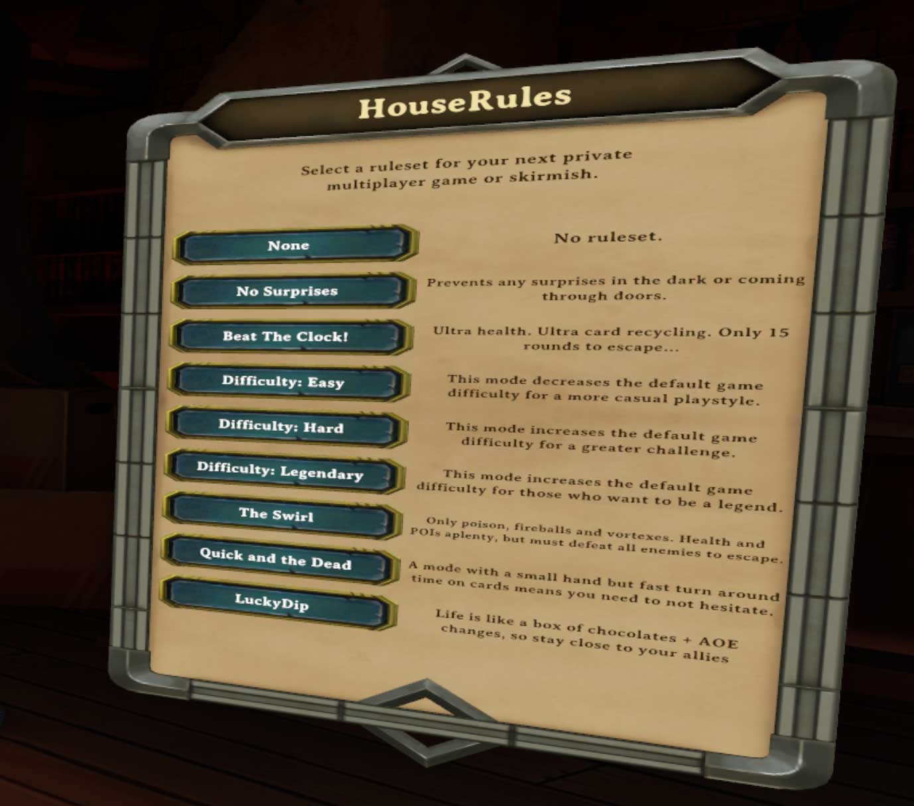

# HouseRules

Set your own challenges and be the Dungeon Master of your own game. Make your own rules and challenge your friends.

A framework allowing the definition of modular gameplay modifications (or
"rules") and the ability to group them to create custom gamemodes (or
"rulesets").

## Overview

Demeo is a board game with a discrete set of rules for play.
In multiplayer games, whoever hosts the game controls _most_ of the games internal logic.

The idea behind HouseRules is:

There can be any number of custom "rules" available, where each rule introduces
some gameplay modification. E.g.:

- Ballistas shoot 2 additional times.
- Players have an extra +1 movement range.
- Players start with +1 strength.
- Speed Potions have an Area Of Effect range
- Zap ability has no action cost
- Players must complete dungeon within 40 rounds.
- Enemies do not respawn.
- Players have different starting cards
- etc

Rules can be grouped into predefined sets.  Users (or other mods) can specify
which ruleset to load at the start of a game.  Thus, rulesets can also be
considered gamemodes.

HouseRules provides the framework for defining custom rules and rulesets, and the
mechanisms by which they are patched into the game and activated/deactivated
during gameplay.

🚨🛑 __IMPORTANT__ - During gameplay client machines update their own board state internally and are periodically sent
updates from the host to resynchronise board states. Some rules may cause temporary inconsistencies with clients
seeing a different board view to the host. These inconsistencies are generally short lived and do not adversly affect gameplay.🛑🚨

## Choosing a Ruleset

Rulesets can be selected dynamically from the in-game menu and default ruleset may be configured via MelonLoader Preferences file.
* A selection of rulesets are built-in, but you can also define your own in JSON.
* Both built-in and JSON rulesets are displayed on the menu.



## MelonLoader Preferences

If installation instructions were followed (i.e., MelonLoader was installed),
the following file will appear in the Demeo game directory:
`UserData/MelonPreferences.cfg`.

Demeo should not be running when you are editing this file or your changes may not be saved.

After RulesAPI is installed and Demeo is run at least once, the following will
appear somewhere in that configuration file:

```toml
[HouseRules]
defaultRuleset = ""
loadRulesetsFromConfig = true
```

A list of out-of-the-box Ruleset names can be found in the
[HouseRules_Essentials readme](../HouseRules_Essentials/README.md).

The name of a default ruleset can be set in `defaultRuleset` - alternatively, use empty quotes `""` to specify no ruleset should be used.
The `loadRulesetsFromConfig` flag can be set to `false` to prevent loading of JSON rulesets.

## User-Defined JSON Rulesets

JSON rulesets can be defined within the Demeo game directory and saved in  `UserData/HouseRules/` as files named `<ruleset_name>.json`. Below is a sample ruleset for improving the life of the Sorcerer. It removes the casting cost on his Zap ability and gives it an extra point of damage.

```json
{
  "Name": "SuperZap",
  "Description": "Zap has no action cost and does 1 extra damage.",
  "Rules": [
    {
      "Rule": "AbilityActionCostAdjustedRule",
      "Config": { "Zap": false, },
    },
    {
      "Rule": "AbilityDamageAdjustedRule",
      "Config": { "Zap": 1 }
    }
  ]
}
```

Saving the above contents as `UserData/HouseRules/SuperZap.json` will allow this ruleset to appear automatically in the in-game HouseRules menu.

A further complete [LuckyDip Ruleset](../docs/LuckyDip.json) is also provided as a reference.

Example JSON samples for each rule type can be found in the
[HouseRules_Essentials readme](../HouseRules_Essentials/README.md).

## Rules vs Mods

A HouseRules rule can be written with as few as a couple dozen lines of code,
and allows it to be loaded selectively by users, or other mods, at playtime.

There are several considerations to make when deciding between writing a
HouseRules rule or a full-blown mod:

- **Gameplay Only**: Rules are activated only during gameplay and not, for
  example, in the main menu.
- **Runs on Host**: Rules are applied only host-side, where the majority of
  gameplay logic is resolved.

For everything else, developers are encouraged to write their own full-blown
mod, rather than try to jam their idea into the RulesAPI framework. 

## Behavior and Conditions

- Only the host of the game needs to have the mod installed.
- Rules are activated only for private or offline games where the user is the host.
- Rules must be registered with RulesAPI before they can be part of a ruleset.
- Rulesets must be registered before they can be selected for activation.
