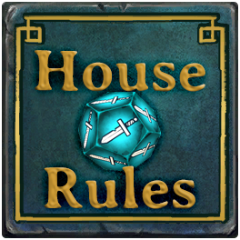

# HouseRules Essentials

A collection of predefined rules and rulesets for HouseRules_Core



See the [HouseRules_Core readme](../HouseRules_Core/README.md) for more information about
HouseRules API.

## Rulesets

### Built-in Rulesets

- __The Swirl__ : Only poison, fireballs and vortexes. Health and POIs aplenty, but must defeat all enemies to escape.
- __Beat The Clock__ : Ultra health. Ultra card recycling. Only 15 rounds to escape...
- __Hunter's Paradise__ : Pets, pets, pets! And hunter's mark.
- __Difficulty Easy__ : Decreased game difficulty for a more casual playstyle.
- __Difficulty Hard__ : Increased game difficulty for a greater challenge.
- __Difficulty Legendary__ : Increased game difficulty for those who want to be a legend.
- __No Surprises__ :  No surprises in the dark or coming through doors.
- __Quick and the Dead__ : A mode with a small hand but fast turnaround time on cards means you need to not hesitate.

### JSON Rulesets

Rulesets may also be configured as JSON files and stored within the game directory `<GAME_DIR>/UserData/HouseRules/<rulesetname>.json`
An example [LuckyDip Ruleset](../docs/LuckyDip.json) which uses many different rules for rapid gameplay is provided as a guide to help you get started.

The [Settings Reference](../docs/SettingsReference.md) contains lists of all different BehaviourIDs, AbilityKeys and other data types used by the Rules.

## Rules and Configurations

- __AbilityActionCostAdjustedRule__: Adjusts the casting costs for player abilitites.
  - Overrides the Ability.CostAP setting for player abilities.
  - `true` means the ability has a cost to cast, `false` means that it doesn't.
  - Config accepts Dictionary e.g. `{ "AbilityName1": bool, "AbilityName2": bool, }`

  <details>
    <summary><i>Show example JSON config for AbilityActionCostAdjustedRule</i></summary>

  ```json
  {
    "Rule": "AbilityActionCostAdjusted",
    "Config": {
      "Zap": false,
      "StrengthenCourage": false,
      "Heal": true,
    }
  },
  ```
  </details>

- __AbilityAoeAdjustedRule__: Adjusts the Area of Effect range(s) for abilities.
  - Does not work with all abilities.
  - Positive integers increase range, negative decrease. e.g. `"Fireball": 1` will increases the Fireball AOE from a 3x3 to 5x5
  - Config accepts Dictionary e.g. `{ "AbilityName1", int, "AbilityName2", int }`

  <details>
    <summary><i>Show example JSON config for AbilityAoeAdjustedRule</summary>

  ```json
  {
    "Rule": "AbilityAoeAdjustedRule",
    "Config": {
      "StrengthenCourage": 1,
      "Strength": 1,
      "Speed": 1,
      "Heal": 1,
    }
  },
  ```
  </details>

- __AbilityDamageAdjustedRule__: Ability damage is adjusted
  - Only functions for abilities which do damage. (You can't make a Heal hurt).
  - CriticalHitDamage is adjusted to double normal damage.
  - Positive numbers increase damage, negative decrease.
  - Config accepts Dictionary `{ "AbilityName1", int, "AbilityName2", int }`

  <details>
    <summary><i>Show Example JSON config for AbilityDamageAdjustedRule</i></summary>

  ```json
  {
    "Rule": "AbilityDamageAdjustedRule",
    "Config": {
      "Zap": 1,
      "Whirlwind": 1,
    }
  },
  ```
  </details>

- __AbilityRandomPieceListRule__: The randomPieceList for Abilities is adjusted
  - 🚧 _Skirmish-only - Does not work properly in multiplayer games._ 🚧
  - Some abilities (NaturesCall, RatBomb) have lists which are used to spawn random pieces.
  - This rule allows the list to be replaced with a different one.
  - Config accepts Dictionary e.g. `{ "AbilityName", BoardpieceId[], "AbilityName2", BoardpieceId[] }`  

  <details>
    <summary><i>Show example JSON config for AbilityRandomPieceListRule</i></summary>

  ```json
  {
    "Rule": "AbilityRandomPieceList",
    "Config": {
      "NaturesCall": [
        "GoblinRanger",
        "Slime",
      ]
    }
  },
  ```
  </details>

- __CardAdditionOverriddenRule__: Overrides the lists of cards which players receive from chests & karma
  - The default card allocation mechanism is intercepted changed to use a user-defined list of cards.
  - Config accepts Dictionary of PieceNames and lists of ability strings.. `{ "PieceName1": ["Ability1", "Ability2"], "PieceName2": ["Ability3", "Ability4"] }`  

  <details>
      <summary><i>Show example JSON config for CardAdditionOverridden</i></summary>

  ```json
  {
    "Rule": "CardAdditionOverridden",
    "Config": {
      "HeroSorcerer": ["Strength", "Speed", "Bone", "Fireball", "Freeze", "SodiumHydroxide", "Teleport", "GodsFury", "RevealPath"],
      "HeroGuardian": ["Whirlwind", "Charge", "CallCompanion", "Heal"],
    }
  },
  ```
  </details>

- __CardEnergyFromAttackMultipliedRule__: Card energy from attack is multiplied
  - Multiply how quickly the mana bar fills up when you attack enemies.
  - Config accepts float e.g. `1.3`  

  <details>
      <summary><i>Show example JSON config for CardEnergyFromAttackMultipliedRule_</i></summary>

  ```json
  {
    "Rule": "CardEnergyFromAttackMultipliedRule",
    "Config": 2.0
  },
  ```
  </details>

- __CardEnergyFromRecyclingMultipliedRule__: Card energy from recycling is multiplied
  - Config accepts float e.g `1.4`  

  <details>
      <summary><i>Show example JSON config for CardEnergyFromRecyclingMultipliedRule_</i></summary>

  ```json
  {
    "Rule": "CardEnergyFromRecyclingMultipliedRule",
    "Config": 2.0
  },
  ```
  </details>

- __CardLimitModifiedRule__: Card limit is modified
  - Change the size of the player's card hand from the default 10/11
  - Config accepts Int e.g `15`  

  <details>
      <summary><i>Show example JSON config for CardLimitModifiedRule</i></summary>

  ```json
  {
    "Rule": "CardLimitModifiedRule",
    "Config": 20
  },
  ```
  </details>

- __CardSellValueMultipliedRule__: Card sell values are multiplied
  - Increase card sale values in the shop.
  - Config accepts float e.g `2.5`  

  <details>
      <summary><i>Show example JSON config for CardSellValueMultipliedRule</i></summary>

  ```json
  {
    "Rule": "CardSellValueMultipliedRule",
    "Config": 2.0
  },
  ```
  </details>

- __EnemyAttackScaledRule__: Enemy ⚔️attack⚔️ damage is scaled
  - Config accepts float e.g `0.85`  

  <details>
      <summary><i>Show example JSON config for EnemyAttackScaledRule</i></summary>

  ```json
  {
    "Rule": "EnemyAttackScaledRule",
    "Config": 0.85
  },
  ```
  </details>

- __EnemyDoorOpeningDisabledRule__: Enemy 🚪door🚪 opening ability disabled
  - Config accepts bool e.g `true`  

  <details>
      <summary><i>Show eample JSON config for EnemyDoorOpeningDisabledRule</i></summary>

  ```json
  {
    "Rule": "EnemyDoorOpeningDisabledRule",
    "Config": true
  },
  ```
  </details>

- __EnemyHealthScaledRule__: Enemy health is scaled
  - Config accepts float e.g `0.85`  

  <details>
      <summary><i>Show example JSON config for EnemyHealthScaledRule</i></summary>

  ```json
  {
    "Rule": "EnemyHealthScaledRule",
    "Config": 0.85
  },
  ```
  </details>

- __EnemyRespawnDisabledRule__: Enemy respawns are disabled
  - Config accepts bool e.g `true`  

  <details>
      <summary><i>Show example JSON config for EnemyRespawnDisabledRule</i></summary>

  ```json
  {
    "Rule": "EnemyRespawnDisabledRule",
    "Config": true
  },
  ```
  </details>

- __GoldPickedUpMultipliedRule__: 💰Gold💰 picked up is multiplied
  - Config accepts float e.g `1.25`  

  <details>
      <summary><i>Show example JSON config for GoldPickedUpMultipliedRule</i></details>

  ```json
  {
    "Rule": "GoldPickedUpMultipliedRule",
    "Config": 1.25
  },
  ```
  </details>

- __LevelExitLockedUntilAllEnemiesDefeatedRule__: The 🔒exit🔑 from each level will not open if any enemies remain.
  - This rule needs to be used in combination with other rules or it will not be possible to complete a level. (e.g. EnemyRespawnDisabledRule)

  <details>
      <summary><i>Show example JSON config for LevelExitLockedUntilAllEnemiesDefeatedRule</i></summary>

  ```json
  {
    "Rule": "LevelExitLockedUntilAllEnemiesDefeatedRule",
    "Config": true
  },
  ```
  </details>

- __LevelPropertiesModifiedRule__: Level properties are modified
  - Allows customisation Loot, Chests and HealingFountains on a per-floor basis
  - Config accepts Dictionary e.g. `{ "ParamName1", int, "ParamName2", int }`

  <details>
      <summary><i>Show example JSON config for LevelPropertiesModifiedRule_</i></summary>
  ```json
  {
    "Rule": "LevelPropertiesModifiedRule",
    "Config": {
      "BigGoldPileChance": 100,
      "FloorOneHealingFountains": 9,
      "FloorOneLootChests": 9,
      "FloorTwoHealingFountains": 9,
      "FloorTwoLootChests": 9,
      "FloorThreeHealingFountains": 9,
      "FloorThreeLootChests": 9,
    }
  },
  ```
  </default>

- __PetsFocusHunterMarkRule__: Pets focus on hunter marked enemies
  - Config accepts bool e.g `true`

  <details>
      <summary><i>Show example JSON config for PetsFocusHunterMarkRule</i></summary>

  ```json
  {
    "Rule": "PetsFocusHunterMarkRule",
    "Config": true
  },
  ```
  </details>

- __PieceAbilityListOverriddenRule__: The list of abilities for a ♟️BoardPiece is overridden.
  - Board pieces have abilities such as LaySpiderEgg or SpawnCultists. This rule allows the lists to be overridden
  - With the right combination of rules, you can turn 🕷️spiderlings into thieves who steal your gold and cards etc
  - Assigning an Ability to a BoardPiece does not necessarily mean that the piece will have a Behaviour to use it.
  - This rule works in conjunction with `PieceBehavioursListOverridden` and `PiecePieceTypesListOverridden`

  <details>
      <summary><i>Show example JSON config for PieceAbilityListOverridden</i></summary>

  ```json
  {
    "Rule": "PieceAbilityListOverridden",
    "Config": {
      "Spiderling": [ "SpiderWebshot", "LaySpiderEgg", "EarthShatter", "AcidSpit", "DropChest", "EnemyStealCard", "EnemyStealGold" ],
      "Rat": [ "DiseasedBite", "SpawnRat", "EnemyStealGold", "SpawnMushrooms", "DropChest", "EnemyStealCard", "EnemyStealGold" ],
      "GoblinFighter": [ "SpawnCultists", "EnemyStealGold", "DropChest", "EnemyStealCard", "EnemyStealGold" ],
    }
  },
  ```
  </details>

- __PieceBehavioursListOverriddenRule__: The list of behaviours that a ♟️BoardPiece behaves is overridden.
  - Board pieces have behaviours such as Patrol, SpawnPiece, AttackandRetreat. This rule allows the lists to be overridden.
  - With the right combination of rules, you can turn 🕷️spiderlings into thieves who steal your gold and cards etc
  - Assigning a behaviour to a particular piece does not mean that the BoardPiece is of the correct PieceType to perform it.
  - This rule works in conjunction with `PieceAbilityListOverridden` and `PiecePieceTypesListOverridden`

  <details>
      <summary><i>Show example JSON config forPieceBehavioursListOverriddenRule</i></summary>

  ```json
  {
    "Rule": "PieceBehavioursListOverridden",
    "Config": {
      "Spiderling": [ "AttackAndRetreat", "Patrol", "FleeToFOW", "HealFromFOW", "ChargeMove" ],
      "Rat": [ "Patrol", "SpawnPiece" ],
      "GoblinFighter": [ "FollowPlayerRangedAttacker", "RangedSpellCaster" ],
    }
  },
  ```
  </details>

- __PieceConfigAdjustedRule__: Allows customization of any numeric field for any ♟️BoardPiece
  - See [PieceConfig.md](../docs/PieceConfig.md) for information about modifiable fields.
  - Allows customization of many of the properties for each game Piece. 🩺Health, 🎲ActionPoints, 🏃Movement, ⚔️MeleeDamage, etc
  - Config accepts List of Dicts e.g. `[ {}, {}, ]`
  - Only works for integer and float fields. The configured value replaces the default.

  <details>
      <summary><i>Show example JSON config for PieceConfigAdjustedRule</i></summary>

  ```json
  {
    "Rule": "PieceConfigAdjustedRule",
    "Config": [
      { "Piece": "HeroSorcerer", "Property": "StartHealth", "Value": 20 },
      { "Piece": "HeroSorcerer", "Property": "MoveRange", "Value": 5 },
      { "Piece": "HeroSorcerer", "Property": "ActionPoint", "Value": 3 },
      { "Piece": "MonsterBait", "Property": "StartHealth", "Value": 30 },
      { "Piece": "BeaconOfSmite", "Property": "ActionPoint", "Value": 2 },
      { "Piece": "HeroSorcerer", "Property": "BerserkBelowHealth", "Value": 0.8 }
    ]
  },
  ```
  </details>

- __PieceImmunityListAdjustedRule__: Allows the list of immunities for any ♟️BoardPiece to be overridden
  - Allows customization of many the list of immunities for each game Piece. 🤢Diseased, 😵Stunned, 🤕Weakened, 🥶Frozen, 🧶Tangled, 💤Petrified , etc
  - Config accepts Dictionary e.g. `{ "HeroSorcerer", EventState[], "RatKing", EventState[], ... }`  

  <details>
      <summary><i>Show example JSON config for PieceImmunityListAdjustedRule</i></summary>

  ```json
  {
    "Rule": "PieceImmunityListAdjusted",
    "Config": {
      "HeroSorcerer": [ "Diseased", "MarkOfAvalon", "Weaken", "Frozen", "Tangled", "Petrified" ],
      "HeroGuardian": [ "Frozen" ],
    }
  },
  ```
  </details>

- __PiecePieceTypeListOverridden__: Allows the list of PieceTypes for a ♟️BoardPiece to be overridden.
  - Board pieces have PieceTypes such as IgnoreWhenCharmed, Brittle, Enemy, Prop, Interactable which dictate certain behaviours.
  - With the right combination of rules, you can turn 🕷️spiderlings into thieves who steal your gold and cards etc
  - Assigning an PieceType to a BoardPiece does not necessarily mean that the piece change its behaviour.
  - This rule works in conjunction with `PieceAbilityListOverridden` and `PieceBehavioursListOverridden`  

  <details>
      <summary><i>Show example JSON config for PieceImmunityListAdjustedRule</i></summary>

  ```json
  {
    "Rule": "PiecePieceTypeListOverridden",
    "Config": {
      "Spiderling": [ "Enemy", "Goblin", "Thief", "Canine" ],
      "Rat": [ "Enemy", "Goblin", "Thief", "Canine" ],
      "GoblinFighter": [ "Enemy", "Goblin", "Thief", "Canine" ],
    }
  },
  ```
  </details>

- __RatNestsSpawnGoldRule__: Rat nests spawn 💰gold💰
  - 🚧 _Skirmish-only - Does not work properly in multiplayer games._ 🚧
  - Config accepts bool e.g `true`  

  <details>
      <summary><i>Show example JSON config for RatNestsSpawnGoldRule</i></summary>

  ```json
  {
    "Rule": "RatNestsSpawnGoldRule",
    "Config": true
  },
  ```
  </details>

- __RoundCountLimitedRule__:  Sets a limit for the maximum number of rounds a game may take.
  - For ⏳ beat-the-clock ⏳ type gameplay.
  - Config accepts integer of number of rounds e.g 50  

  <details>
      <summary><i>Show example JSON config for RoundCountLimitedRule</summary>

  ```json
  {
    "Rule": "RoundCountLimitedRule",
    "Config": 40
  },
  ```
  </details>

- __SampleRule__: A [sample rule](Rules/SampleRule.cs) documenting the anatomy
  of a HouseRule rule.

- __StartCardsModifiedRule__: Player 🎴 starting cards 🎴 are modified
  - Removes all default cards from Player's hand and replaces them with custom ones.
  - Replenishable cards do not leave a players hand once cast (e.g. RepairArmor, HunterArrow or Zap)
  - Max of two replenishable cards per player.
  - Config accepts Dictionary of list of dicts e.g. `{ "<HeroName1": [ { "Card" : "<CardName>","isReplenishable": bool }, ... ], ...  }`

  <details>
      <summary><i>Show example JSON config for StartCardsModifiedRule</i></summary>

  ```json
  {
    "Rule": "StartCardsModifiedRule",
    "Config": {
      "HeroGuardian": [
        { "Card": "Heal", "IsReplenishable": false },
        { "Card": "ReplenishArmor", "IsReplenishable": true },
        { "Card": "Whirlwind", "IsReplenishable": true },
        { "Card": "PiercingSpear", "IsReplenishable": false },
        { "Card": "CoinFlip", "IsReplenishable": false },
        { "Card": "BeaconOfSmite", "IsReplenishable": false },
        { "Card": "SwordOfAvalon", "IsReplenishable": false },
      ],
      "HeroHunter": [
        { "Card": "Heal", "IsReplenishable": false },
        { "Card": "HunterArrow", "IsReplenishable": true },
        { "Card": "HunterArrow", "IsReplenishable": true },
        { "Card": "CoinFlip", "IsReplenishable": false },
        { "Card": "DropChest", "IsReplenishable": false },
      ],
      "HeroSorcerer": [
        { "Card": "Heal", "IsReplenishable": false },
        { "Card": "Zap", "IsReplenishable": true },
        { "Card": "Whirlwind", "IsReplenishable": true },
        { "Card": "Freeze", "IsReplenishable": false },
        { "Card": "Fireball", "IsReplenishable": false },
        { "Card": "CallCompanion", "IsReplenishable": false },
      ],
    }
  },
  ```
  </details>

  - __StatModifiersOverriden__: The additiveBonus parameters of StatModifiers are overridden.
  - There are only six different StatModifiers in the game. They are used by 💪Strength, 🦶Speed, 🛡️ReplenishArmor, HuntersMark, etc
  - Accepts a list of overrides which take the place of the default config.
  - If no override is specified, the default is used instead.
  - Config accepts list of dict of StatModifier names, integer values. `{"Statmodifier": int}, {}, }`

  <details>
      <summary><i>Show example JSON config for StatModifiersOverriden</i></summary>

  ```json
  {
    "Rule": "StatModifiersOverriden",
    "Config": {
      "Strength": 2,
      "Speed": 2,
      "MarkOfAvalon": -4,
      "ReplenishBarkArmor": 4,
      "SongOfResilience": 6,
      "ReplenishArmor": 4,
    }
  },
  ```
  </details>

  - __StatusEffectConfigRule__: The parameters of different StatusEffects (🔥Torch, 🤢Poison, 🥶Frozen) can be overridden
  - Accepts a list of overrides which take the place of the default config.
  - If no override is specified, the default is used instead.
  - Default values can be found in `StatusEffectsConfig.effectsConfig`
  - Config accepts list of dicts e.g. `[ {}, {}, ]`

    <details>
        <summary><i>Show example JSON config for StatusEffectConfigRule</i></summary>

  ```json
  {
    "Rule": "StatusEffectConfig",
    "Config": [
      {
        "effectStateType": "TorchPlayer",
        "durationTurns": 15,
        "tickWhen": "StartTurn",
        "stacks": true,
        "damagePerTurn": 0,
        "clearOnNewLevel": false,
        "damageTags": null,
        "healPerTurn": 0
      },
      {
        "effectStateType": "HealingSong",
        "durationTurns": 4,
        "tickWhen": "StartTurn",
        "stacks": false,
        "damagePerTurn": 0,
        "clearOnNewLevel": false,
        "damageTags": null,
        "healPerTurn": 3
      },
    ]
  },
  ```
  </details>
