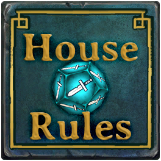

# HouseRules Essentials

A collection of predefined rules and rulesets for HouseRules_Core



See the [HouseRules_Core readme](../HouseRules_Core/README.md) for more information about
HouseRules API.

## Rulesets

### Built-in Rulesets

- __The Swirl__ : Only poison, fireballs and vortexes. Health and POIs aplenty, but must defeat all enemies to escape.
- __Beat The Clock__ : Ultra health. Ultra card recycling. Only 15 rounds to escape...
- __Hunter's Paradise__ : Pets, pets, pets! And hunter's mark.
- __Difficulty Easy__ : Decreased game difficulty for a more casual playstyle.
- __Difficulty Hard__ : Increased game difficulty for a greater challenge.
- __Difficulty Legendary__ : Increased game difficulty for those who want to be a legend.
- __No Surprises__ :  No surprises in the dark or coming through doors.
- __Quick and the Dead__ : A mode with a small hand but fast turnaround time on cards means you need to not hesitate.

### JSON Rulesets

Rulesets may also be configured as JSON files and stored within the game directory `<GAME_DIR>/UserData/HouseRules/<rulesetname>.json`

A selection are available within this repository. These are intended to be fun to play alternative games, and as a good examples for others wanting to create their own rulesets.

- __[🎲LuckyDip🎲 Ruleset](../docs/rulesets/LuckyDip.json)__ : Players each start with two 'Drop Chest' cards instead of their normal
starting cards, meaning that no two games start the same. Many potions have AOE effect, because it's rude not to share. 
Many other changes included for faster gameplay with an aim of around 90 minutes per game.
- __[🕷️Arachnophobia🕷️ Ruleset](../docs/rulesets/Arachnophobia.json)__ offers a fresh adventure to be played on the RootsOfEvil Map.
Chased by violent thugs from their ancestral homes in Sunderhaven, the King and Queen flee into the woods. 
Befriended by money spiders, they hatch a plan to rebuild their fallen empires, but first they're going to need some cash.

The [Settings Reference](../docs/SettingsReference.md) contains lists of all different BehaviourIDs, AbilityKeys and other data types used by the Rules.

## Rules and Configurations

- __AbilityActionCostAdjustedRule__: Adjusts the casting costs for player abilitites.
  - Overrides the Ability.CostAP setting for player abilities.
  - `true` means the ability has a cost to cast, `false` means that it doesn't.
  - Config accepts Dictionary e.g. `{ "AbilityName1": bool, "AbilityName2": bool, }`
  
  ###### _Example JSON config for AbilityActionCostAdjustedRule_

  ```json
  {
    "Rule": "AbilityActionCostAdjusted",
    "Config": {
      "Zap": false,
      "CourageShanty": false,
      "HealingPotion": true,
    }
  },
  ```

- __AbilityAoeAdjustedRule__: Adjusts the Area of Effect range(s) for abilities.
  - Does not work with all abilities.
  - Positive integers increase range, negative decrease. e.g. `"Fireball": 1` will increases the Fireball AOE from a 3x3 to 5x5
  - Config accepts Dictionary e.g. `{ "AbilityName1", int, "AbilityName2", int }`
  
  ###### _Example JSON config for AbilityAoeAdjustedRule_

  ```json
  {
    "Rule": "AbilityAoeAdjustedRule",
    "Config": {
      "CourageShanty": 1,
      "StrengthPotion": 1,
      "SwiftnessPotion": 1,
      "HealingPotion": 1,
    }
  },
  ```

- __AbilityBackstabAdjustedRule__: Adjusts the enableBackstabBonus setting for abilities.
  - Does not work with all abilities.
  - Config accepts Dictionary e.g. `{ "AbilityName1", bool, "AbilityName2", bool }`
  
  ###### _Example JSON config for AbilityBackstabAdjustedRule_

  ```json
  {
    "Rule": "AbilityBackstabAdjustedRule",
    "Config": {
      "Zap": true,
      "HunterArrow": true,
      "PiercingArrow": true,
      "PoisonTip": true,
      "Fireball": true,
      "Freeze": true,
    }
  },
  ```

- __AbilityDamageAdjustedRule__: Ability damage is adjusted
  - Only functions for abilities which do damage. (You can't make a HealingPotion hurt).
  - CriticalHitDamage is adjusted to double normal damage.
  - Positive numbers increase damage, negative decrease.
  - Config accepts Dictionary `{ "AbilityName1", int, "AbilityName2", int }`

  ###### _Example JSON config for AbilityDamageAdjustedRule_

  ```json
  {
    "Rule": "AbilityDamageAdjustedRule",
    "Config": {
      "Zap": 1,
      "Whirlwind": 1,
    }
  },
  ```

- __AbilityRandomPieceListRule__: The randomPieceList for Abilities is adjusted
  - 🚧 _Skirmish-only - Does not work properly in multiplayer games._ 🚧
  - Some abilities (BeastWhisperer, RatBomb) have lists which are used to spawn random pieces.
  - This rule allows the list to be replaced with a different one.
  - Config accepts Dictionary e.g. `{ "AbilityName", BoardpieceId[], "AbilityName2", BoardpieceId[] }`  

  ###### _Example JSON config for AbilityRandomPieceListRule_

  ```json
  {
    "Rule": "AbilityRandomPieceList",
    "Config": {
      "BeastWhisperer": [
        "GoblinRanger",
        "Slime",
      ]
    }
  },
  ```

- __BackstabConfigOverriddenRule__: A list of Pieces may use 🔪Backstab🔪 instead of just the Assassin
  - Replaces the hardcoded default of HeroRogue with a configurable list.
  - Now everyone can benefit from Backstab bonus..
  - Config accepts List of BoardPieceIDs e.g. `[ "HeroGuardian", "HeroSorcerer", ...]`  

  ###### _Example JSON config for BackstabConfigOverriddenRule_

  ```json
    {
      "Rule": "BackstabConfigOverridden",
      "Config": [ "HeroGuardian", "HeroHunter", "HeroSorcerer", "HeroRogue", "HeroBard" ]
    },
  ```

- __CardAdditionOverriddenRule__: Overrides the lists of cards which players receive from chests & karma
  - The default card allocation mechanism is intercepted changed to use a user-defined list of cards.
  - Config accepts Dictionary of PieceNames and lists of ability strings.. `{ "PieceName1": ["Ability1", "Ability2"], "PieceName2": ["Ability3", "Ability4"] }`  

  ###### _Example JSON config for CardAdditionOverridden_

  ```json
  {
    "Rule": "CardAdditionOverridden",
    "Config": {
      "HeroSorcerer": ["StrengthPotion", "SwiftnessPotion", "Bone", "Fireball", "Freeze", "BottleOfLye", "Teleportation", "HeavensFury", "RevealPath"],
      "HeroGuardian": ["Whirlwind", "Charge", "CallCompanion", "HealingPotion"],
    }
  },
  ```

- __CardEnergyFromAttackMultipliedRule__: Card energy from attack is multiplied
  - Multiply how quickly the mana bar fills up when you attack enemies.
  - Config accepts float e.g. `1.3`  

  ###### _Example JSON config for CardEnergyFromAttackMultipliedRule_

  ```json
  {
    "Rule": "CardEnergyFromAttackMultipliedRule",
    "Config": 2.0
  },
  ```

- __CardEnergyFromRecyclingMultipliedRule__: Card energy from recycling is multiplied
  - Config accepts float e.g `1.4`  

  ###### _Example JSON config for CardEnergyFromRecyclingMultipliedRule_

  ```json
  {
    "Rule": "CardEnergyFromRecyclingMultipliedRule",
    "Config": 2.0
  },
  ```

- __CardLimitModifiedRule__: Card limit is modified
  - 🚧 _Skirmish-only - Does not work properly in multiplayer games._ 🚧
  - Change the size of the player's card hand from the default 10/11
  - Config accepts Int e.g `15`  

  ###### _Example JSON config for CardLimitModifiedRule_

  ```json
  {
    "Rule": "CardLimitModifiedRule",
    "Config": 20
  },
  ```

- __CardSellValueMultipliedRule__: Card sell values are multiplied
  - Increase card sale values in the shop. 
  - Config accepts float e.g `2.5`  

  ###### _Example JSON config for CardSellValueMultipliedRule_

  ```json
  {
    "Rule": "CardSellValueMultipliedRule",
    "Config": 2.0
  },
  ```

- __CardClassRestrictionOverriddenRule__: Overrides Character Class assignments for cards.
  - Cards with a character class of `None` are usable by all players.
  - Cards may be disbled from play by assigning to a non-player Character
  - Cards may be reassigned to other player characters  

  ###### _Example JSON config for CardClassRestrictionOverriddenRule_

  ```json
    {
      "Rule": "CardClassRestrictionOverridden",
      "Config": {
        "BeastWhisperer": "Mushroom",
        "Sneak": "Guardian",
        "Zap": "Hunter",
      }
    },
  ```

- __EnemyAttackScaledRule__: Enemy ⚔️attack⚔️ damage is scaled
  - Config accepts float e.g `0.85`  

  ###### _Example JSON config for EnemyAttackScaledRule_

  ```json
  {
    "Rule": "EnemyAttackScaledRule",
    "Config": 0.85
  },
  ```

- __EnemyDoorOpeningDisabledRule__: Enemy 🚪door🚪 opening ability disabled
  - Config accepts bool e.g `true`  

  ###### _Example JSON config for EnemyDoorOpeningDisabledRule_

  ```json
  {
    "Rule": "EnemyDoorOpeningDisabledRule",
    "Config": true
  },
  ```

- __EnemyHealthScaledRule__: Enemy health is scaled
  - Config accepts float e.g `0.85`  

  ###### _Example JSON config for EnemyHealthScaledRule_

  ```json
  {
    "Rule": "EnemyHealthScaledRule",
    "Config": 0.85
  },
  ```

- __EnemyRespawnDisabledRule__: Enemy respawns are disabled
  - Config accepts bool e.g `true`  

  ###### _Example JSON config for EnemyRespawnDisabledRule_

  ```json
  {
    "Rule": "EnemyRespawnDisabledRule",
    "Config": true
  },
  ```

- __GoldPickedUpMultipliedRule__: 💰Gold💰 picked up is multiplied
  - Config accepts float e.g `1.25`  

  ###### _Example JSON config for GoldPickedUpMultipliedRule_

  ```json
  {
    "Rule": "GoldPickedUpMultipliedRule",
    "Config": 1.25
  },
  ```

- __LevelExitLockedUntilAllEnemiesDefeatedRule__: The 🔒exit🔑 from each level will not open if any enemies remain.
  - This rule needs to be used in combination with other rules or it will not be possible to complete a level. (e.g. EnemyRespawnDisabledRule)

  ###### _Example JSON config for LevelExitLockedUntilAllEnemiesDefeatedRule_

  ```json
  {
    "Rule": "LevelExitLockedUntilAllEnemiesDefeatedRule",
    "Config": true
  },
  ```

- __LevelPropertiesModifiedRule__: Level properties are modified
  - Allows customisation Loot, Chests and HealingFountains on a per-floor basis
  - Config accepts Dictionary e.g. `{ "ParamName1", int, "ParamName2", int }`

  ###### _Example JSON config for LevelPropertiesModifiedRule_

  ```json
  {
    "Rule": "LevelPropertiesModifiedRule",
    "Config": {
      "BigGoldPileChance": 100,
      "FloorOneHealingFountains": 9,
      "FloorOneLootChests": 9,
      "FloorTwoHealingFountains": 9,
      "FloorTwoLootChests": 9,
      "FloorThreeHealingFountains": 9,
      "FloorThreeLootChests": 9,
    }
  },
  ```

- __PetsFocusHunterMarkRule__: Pets focus on hunter marked enemies
  - Config accepts bool e.g `true`

  ###### _Example JSON config for PetsFocusHunterMarkRule_

  ```json
  {
    "Rule": "PetsFocusHunterMarkRule",
    "Config": true
  },
  ```

- __PieceAbilityListOverriddenRule__: The list of abilities for a ♟️BoardPiece is overridden.
  - Board pieces have abilities such as LaySpiderEgg or SpawnCultists. This rule allows the lists to be overridden
  - With the right combination of rules, you can turn 🕷️spiderlings into thieves who steal your gold and cards etc
  - Assigning an Ability to a BoardPiece does not necessarily mean that the piece will have a Behaviour to use it.
  - This rule works in conjunction with `PieceBehavioursListOverridden` and `PiecePieceTypesListOverridden` 

  ###### _Example JSON config for PieceAbilityListOverridden_

  ```json
  {
    "Rule": "PieceAbilityListOverridden",
    "Config": {
      "Spiderling": [ "SpiderWebshot", "LaySpiderEgg", "EarthShatter", "AcidSpit", "DropChest", "EnemyStealCard", "EnemyStealGold" ],
      "Rat": [ "DiseasedBite", "SpawnRat", "EnemyStealGold", "SpawnMushrooms", "DropChest", "EnemyStealCard", "EnemyStealGold" ],
      "GoblinFighter": [ "SpawnCultists", "EnemyStealGold", "DropChest", "EnemyStealCard", "EnemyStealGold" ],
    }
  },
  ```

- __PieceBehavioursListOverriddenRule__: The list of behaviours that a ♟️BoardPiece behaves is overridden.
  - Board pieces have behaviours such as Patrol, SpawnPiece, AttackandRetreat. This rule allows the lists to be overridden.
  - With the right combination of rules, you can turn 🕷️spiderlings into thieves who steal your gold and cards etc
  - Assigning a behaviour to a particular piece does not mean that the BoardPiece is of the correct PieceType to perform it.
  - This rule works in conjunction with `PieceAbilityListOverridden` and `PiecePieceTypesListOverridden` 

  ###### _Example JSON config forPieceBehavioursListOverriddenRule_

  ```json
  {
    "Rule": "PieceBehavioursListOverridden",
    "Config": {
      "Spiderling": [ "AttackAndRetreat", "Patrol", "FleeToFOW", "HealFromFOW", "ChargeMove" ],
      "Rat": [ "Patrol", "SpawnPiece" ],
      "GoblinFighter": [ "FollowPlayerRangedAttacker", "RangedSpellCaster" ],
    }
  },
  ```

- __PieceConfigAdjustedRule__: Allows customization of any numeric field for any ♟️BoardPiece
  - See [PieceConfig.md](../docs/PieceConfig.md) for information about modifiable fields.
  - Allows customization of many of the properties for each game Piece. 🩺Health, 🎲ActionPoints, 🏃Movement, ⚔️MeleeDamage, etc
  - Config accepts List of Dicts e.g. `[ {}, {}, ]`
  - Only works for integer and float fields. The configured value replaces the default.

  ###### _Example JSON config for PieceConfigAdjustedRule_

  ```json
  {
    "Rule": "PieceConfigAdjustedRule",
    "Config": [
      { "Piece": "HeroSorcerer", "Property": "StartHealth", "Value": 20 },
      { "Piece": "HeroSorcerer", "Property": "MoveRange", "Value": 5 },
      { "Piece": "HeroSorcerer", "Property": "ActionPoint", "Value": 3 },
      { "Piece": "Lure", "Property": "StartHealth", "Value": 30 },
      { "Piece": "TheBehemoth", "Property": "ActionPoint", "Value": 2 },
      { "Piece": "HeroSorcerer", "Property": "BerserkBelowHealth", "Value": 0.8 }
    ]
  },
  ```
  
- __PieceImmunityListAdjustedRule__: Allows the list of immunities for any ♟️BoardPiece to be overridden
  - Allows customization of many the list of immunities for each game Piece. 🤢Diseased, 😵Stunned, 🤕Weakened, 🥶Frozen, 🧶Tangled, 💤Petrified , etc
  - Config accepts Dictionary e.g. `{ "HeroSorcerer", EventState[], "RatKing", EventState[], ... }`  

  ###### _Example JSON config for PieceImmunityListAdjustedRule_

  ```json
  {
    "Rule": "PieceImmunityListAdjusted",
    "Config": {
      "HeroSorcerer": [ "Diseased", "HuntersMark", "Weaken", "Frozen", "Tangled", "Petrified" ],
      "HeroGuardian": [ "Frozen" ],
    }
  },
  ```

- __PiecePieceTypeListOverridden__: Allows the list of PieceTypes for a ♟️BoardPiece to be overridden.
  - Board pieces have PieceTypes such as IgnoreWhenCharmed, Brittle, Enemy, Prop, Interactable which dictate certain behaviours.
  - With the right combination of rules, you can turn 🕷️spiderlings into thieves who steal your gold and cards etc
  - Assigning an PieceType to a BoardPiece does not necessarily mean that the piece change its behaviour.
  - This rule works in conjunction with `PieceAbilityListOverridden` and `PieceBehavioursListOverridden`  

  ###### _Example JSON config for PieceImmunityListAdjustedRule_

  ```json
  {
    "Rule": "PiecePieceTypeListOverridden",
    "Config": {
      "Spiderling": [ "Enemy", "Goblin", "Thief", "Canine" ],
      "Rat": [ "Enemy", "Goblin", "Thief", "Canine" ],
      "GoblinFighter": [ "Enemy", "Goblin", "Thief", "Canine" ],
    }
  },
  ```
  
- __PieceUseWhenKilledOverriddenRule__: Allows the list of UseWhenKilled abilities for any ♟️BoardPiece to be overridden
  - Abilities are trigged at the a piece dies. 
  - Config accepts Dictionary of boardpieceIDs and Lists of AbilityKeys e.g. ` "BoardPieceID": [ "AbilityKey1", "AbilityKey2" ] }`  

  ###### _Example JSON config for PieceUseWhenKilledOverriddenRule_

  ```json
  {
    "Rule": "PieceUseWhenKilledOverridden",
    "Config": {
      "Spiderling": [ "HealingPotion" ],
      "CaveTroll": [ "Rejuvenation" ],
    }
  },
  ```

- __RatNestsSpawnGoldRule__: Rat nests spawn 💰gold💰
  - 🚧 _Skirmish-only - Does not work properly in multiplayer games._ 🚧
  - Config accepts bool e.g `true`  

  ###### _Example JSON config for RatNestsSpawnGoldRule_

  ```json
  {
    "Rule": "RatNestsSpawnGoldRule",
    "Config": true
  },
  ```

- __RegainAbilityIfMaxxedOutOverriddenRule__: Controls whether you get a potion back when you cast it on someone who is already at max.
  - This rule is to overcome a mana-farming 'feature' that occurs if you apply an AOE range onto Strength/Speed potions. By default when you cast a strength or speed potion on someone who is already maxxed out, you get it returned to your hand. If you cast a potion on a group who are maxxed, you get one-potion-per-player returned back to your hand. This is effectively free-mana whenever you want it.
  - This rule exists to control that behaviour. By setting Abilities to `false` you can prevent the card being returned to the player's hand.
  - Config accepts dictionary of ability name and bool.  

  ###### _Example JSON config for RegainAbilityIfMaxxedOutOverriddenRule_

  ```json
    {
      "Rule": "RegainAbilityIfMaxxedOutOverridden",
      "Config": {
        "SwiftnessPotion": false,
        "StrengthPotion": false
      }
    },
  ```

- __RoundCountLimitedRule__:  Sets a limit for the maximum number of rounds a game may take.
  - For ⏳ beat-the-clock ⏳ type gameplay.
  - Config accepts integer of number of rounds e.g 50  

  ###### _Example JSON config for RoundCountLimitedRule_

  ```json
  {
    "Rule": "RoundCountLimitedRule",
    "Config": 40
  },
  ```

- __SampleRule__: A [sample rule](Rules/SampleRule.cs) documenting the anatomy
  of a HouseRule rule.

- __SpawnCategoryOverriddenRule__:  Overrides the Spawn Categories which control distribution of pieces in each map.
  - Each dungeon has a list of pieces which may appear, and controlling properties.
  - This rule replaces the list (for all dungeons) with a new one.
  - Per-Piece properties for `MaxPerDeck`, `PreFill` and `FirstAllowedLevelIndex` must be specified.
  - Pieces which are not listed in the config will have `IsSpawningEnabled` set to `false` to disable pieces from auto-populating a map.
  - Does not have absolute control over what monsters will appear. Bosses bring support chars etc.
  - Config accepts list of dicts { "BoardPieceID": [ MaxPerDeck, PreFill, FirstAllowedLevelIndex ], ... }

  ###### _Example JSON config for SpawnCategoryOverriddenRule_

  ```json
    {
      "Rule": "SpawnCategoryOverridden",
      "Config": {
        "Spiderling": [ 200, 50, 1 ],
        "SpiderEgg": [ 20, 10, 1 ] ,
        "LargeSpider": [ 30, 10, 1 ],
        "RatKing": [ 1, 1, 1 ],
        "DarkElfGoddessBoss": [ 1, 1, 2 ],
      }
    },
  ```

- __StartCardsModifiedRule__: Player 🎴 starting cards 🎴 are modified
  - Removes all default cards from Player's hand and replaces them with custom ones.
  - Replenishable cards do not leave a players hand once cast (e.g. RepairArmor, HunterArrow or Zap)
  - Max of two replenishable cards per player.
  - Config accepts Dictionary of list of dicts e.g. `{ "HeroName1": [ { "Card" : "CardName","isReplenishable": bool }, ... ], ...  }`

  ###### _Example JSON config for StartCardsModifiedRule_

  ```json
  {
    "Rule": "StartCardsModifiedRule",
    "Config": {
      "HeroGuardian": [
        { "Card": "HealingPotion", "IsReplenishable": false },
        { "Card": "ReplenishArmor", "IsReplenishable": true },
        { "Card": "Whirlwind", "IsReplenishable": true },
        { "Card": "PiercingThrow", "IsReplenishable": false },
        { "Card": "CoinFlip", "IsReplenishable": false },
        { "Card": "TheBehemoth", "IsReplenishable": false },
        { "Card": "SwordOfAvalon", "IsReplenishable": false },
      ],
      "HeroHunter": [
        { "Card": "HealingPotion", "IsReplenishable": false },
        { "Card": "HunterArrow", "IsReplenishable": true },
        { "Card": "HunterArrow", "IsReplenishable": true },
        { "Card": "CoinFlip", "IsReplenishable": false },
        { "Card": "DropChest", "IsReplenishable": false },
      ],
      "HeroSorcerer": [
        { "Card": "HealingPotion", "IsReplenishable": false },
        { "Card": "Zap", "IsReplenishable": true },
        { "Card": "Whirlwind", "IsReplenishable": true },
        { "Card": "Freeze", "IsReplenishable": false },
        { "Card": "Fireball", "IsReplenishable": false },
        { "Card": "CallCompanion", "IsReplenishable": false },
      ],
    }
  },
  ```

  - __StatModifiersOverriden__: The additiveBonus parameters of StatModifiers are overridden.
  - There are only six different StatModifiers in the game. They are used by 💪StrengthPotion, 🦶SwiftnessPotion, 🛡️ReplenishArmor, HuntersMark, etc
  - Accepts a list of overrides which take the place of the default config.
  - If no override is specified, the default is used instead.
  - Config accepts list of dict of StatModifier names, integer values. `{"Statmodifier": int}, {}, }`

  ###### _Example JSON config for StatModifiersOverriden_

  ```json
  {
    "Rule": "StatModifiersOverriden",
    "Config": {
      "StrengthPotion": 2,
      "SwiftnessPotion": 2,
      "HuntersMark": -4,
      "ReplenishBarkArmor": 4,
      "SongOfResilience": 6,
      "ReplenishArmor": 4,
    }
  },
  ```

  - __StatusEffectConfigRule__: The parameters of different StatusEffects (🔥Torch, 🤢Poison, 🥶Frozen) can be overridden
  - Accepts a list of overrides which take the place of the default config.
  - If no override is specified, the default is used instead.
  - Default values can be found in `StatusEffectsConfig.effectsConfig`
  - Config accepts list of dicts e.g. `[ {}, {}, ]`

  ###### _Example JSON config for StatusEffectConfigRule_

  ```json
  {
    "Rule": "StatusEffectConfig",
    "Config": [
      {
        "effectStateType": "TorchPlayer",
        "durationTurns": 15,
        "tickWhen": "StartTurn",
        "stacks": true,
        "damagePerTurn": 0,
        "clearOnNewLevel": false,
        "damageTags": null,
        "healPerTurn": 0
      },
      {
        "effectStateType": "HealingSong",
        "durationTurns": 4,
        "tickWhen": "StartTurn",
        "stacks": false,
        "damagePerTurn": 0,
        "clearOnNewLevel": false,
        "damageTags": null,
        "healPerTurn": 3
      },
    ]
  },
  ```
