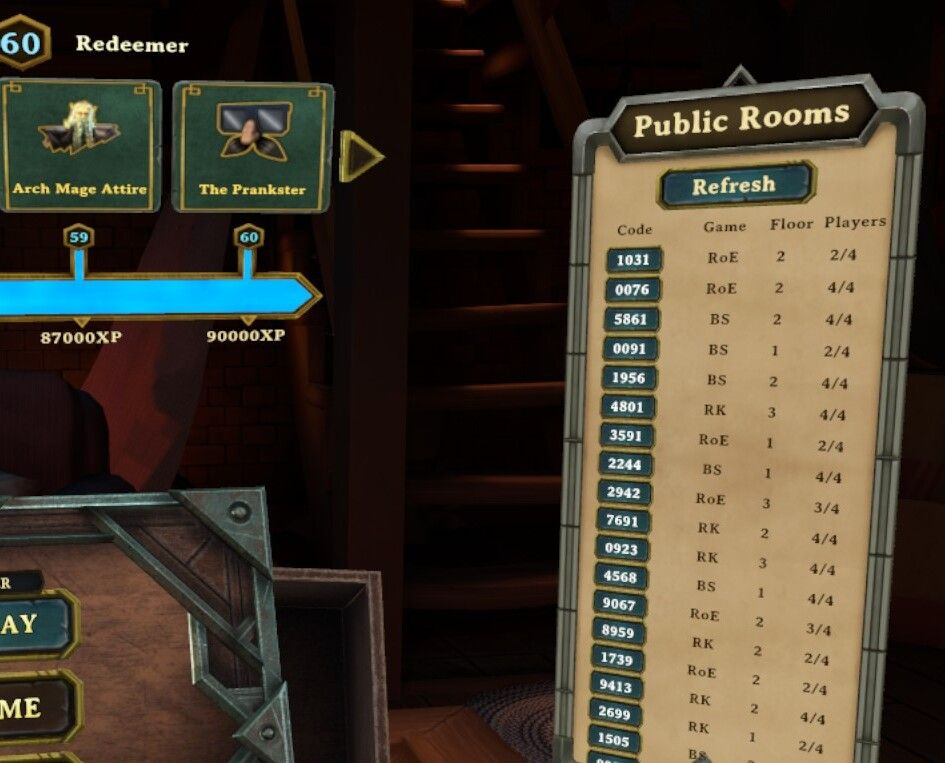

# DemeoMods

A collection of mods for Demeo.

## Mods

### SkipIntro

Skips the intro loading scene.

### RoomFinder

Tired of Demeo's "Quickjoin" endlessly placing you into random games? This mod lists all public rooms, along with their
properties, so you can find a game you'd like and join it directly.

### Hmm ...

A handful of other mods are in use/development privately, but it is unknown if any will be cleaned up enough to see the
light of OSS.

- PlayerBerserk, allows players to become berserk/enraged.
- RoomCode, allows players to set their own room code instead of one being randomly generated.
- Highlighter, ...
- RuleSets, ...
- DungeonMasterView, ...

## Requirements

- [Install MelonLoader](https://github.com/LavaGang/MelonLoader#how-to-use-the-installer).

> Note: Only PCVR versions of games are currently supported.
> E.g., playing on a Quest2 works, but only when linked to a PC.

## Installation

Download the the mod that you would like from the releases page.

Place the mod's DLL into the `/Mods` folder (created by MelonLoader) in your game directory.

## For Developers

### `/Common`

A library of entities shared by more than one mod.

This is compiled as part of each dependent mod, so as to not generate a common/util mod that needs to be included
separately by each user.

Should there be any interest by other developers to reuse this library, the author of this project can extract it into a
common/util mod or a [nuget](https://www.nuget.org/).

Please file an issue if interested.

### `/Common/UiUtil`

The start of a UI library, before the author decided too much time was being spent on it :wink:. Now a set of helpers to
make development of Unity views for Demeo significantly easier.

## Shoutouts

Looking for support, other Demeo mods, or want to learn to build your own? Join the Demeo modding community:

- Thanks to [PyrrhaDevs](https://github.com/PyrrhaDevs) for fostering the Demeo modding community.
- Thanks to [Pokachi](https://github.com/Pokachi) for heavy early exploration of Demeo+Unity in the context of modding,
  and making those findings available to the community.
