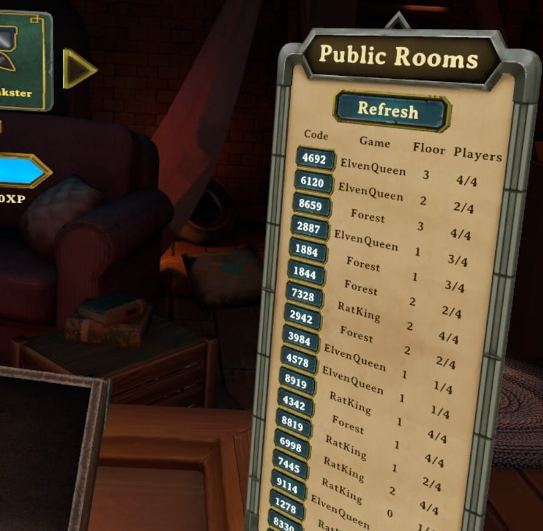

# DemeoMods

A collection of mods for Demeo.

Join the Demeo modding community if you are looking for support, other Demeo
mods, or are interested in learning to build your own.

## Contents
- [Mods](#mods)
  - [HouseRules](#houserules)
  - [SkipIntro](#skipintro)
  - [RoomFinder](#roomfinder)
  - [RoomCode](#roomcode)
- [Installation](#installation)
- [For Developers](#for-developers)
- [Shoutouts](#shoutouts)

## Mods

### HouseRules

Set your own challenges and be the Dungeon Master of your own game. Make your own rules and challenge your friends.

HouseRules applies customisations to many settings, values and toggles used within the Demeo code.

- Change the size of your card hand (Skirmish Mode Only)
- Adjust HP, AttackDamage, ActionPoints etc on a per-character basis
- Scale gold/mana/chests up/down
- Change starting cards dealt and max-cards allowed
- Add/Adjust AOE effects for abilities.
- Remove/add casting cost for cards
- Beat-the-clock Game Timer modes
- Specify cards distributed to players
- Change immunities for different pieces
- Prevent enemies respawing
- Keep the exit locked until all of the enemies are dead
- ... and many more.

This framework allows the definition of modular gameplay modifications (or
"rules") and the ability to group them to create custom gamemodes (or
"rulesets").

Rulesets can be configured as JSON files stored within the game's directoy.
It is currently necessary to select the ruleset by editing the `MelonloaderPreferences.cfg` file before starting the game.

See the [HouseRules_Core readme](HouseRules_Core/README.md) for information about the
HouseRules framework.

See the [HouseRules_Essentials readme](HouseRules_Essentials/README.md) for a list of all predefined RulesAPI
rules and rulesets.

#### How it works

HouseRules creates multiplayer games which are playable by ALL Demeo players (both Quest and PC), but the mod itself currently runs only on PC. In order to play with a modified ruleset, the player hosting the game must be on a PC running this mod. Unmodded clients are able to join the modded game as normal and play with new game rules.

🚨🛑 __IMPORTANT__ - During gameplay client machines will update their board state internally - They are sent frequent updates from the host to resynchronise board states. Some rules may cause temporary inconsistencies with clients seeing a different board view to the host. These inconsistencies are generally short lived and do not adversly affect gameplay.🛑🚨

#### Get in Touch

We have a dedicated [HouseRules Discord Channel ](https://discord.gg/N9DZB5ebmj) to chat about gameplay, new rule ideas, report bugs or maybe get involved with writing some new rules. Come over and say 👋 'Hi' 👋

### SkipIntro

The Elven Necropolis is a very welcoming place... some might say it's too welcoming.

The SkipIntro mod skips the intro loading scene and takes you straight into the main menu.

You will never again need to 

### RoomFinder

Tired of Demeo's "Quickjoin" endlessly placing you into random games? This mod
lists all public rooms, along with their properties, so you can pick which one
to join.

### RoomCode

Set your own room code, skipping Demeo's random room code generation.

See the [RoomCode readme](RoomCode/README.md) for more information and configuration
options.

## Installation

> Note: Only PCVR versions of games are currently supported.
> E.g., playing on a Quest2 works, but only when linked to a PC.

1. Install [MelonLoader](https://github.com/LavaGang/MelonLoader#how-to-use-the-installer)
   (must be version `0.5.3` or later).
2. Download the the mods that you would like to use from
   the [releases page](https://github.com/orendain/DemeoMods/releases).
3. Place the mod DLL files in the `/Mods` folder (created by MelonLoader) in
   your game directory.
4. Done. The mods will load automatically upon starting the game.

## For Developers

### `/Common`

A library shared by more than one mod. This is compiled as part of each mod.

Should there be any interest by other developers to reuse this library, the
author of this project can extract it into a common/util mod or
a NuGet.

Please file an issue if interested.

### `/Common/UI`

The start of a UI library, before the author decided too much time was being
spent on it :wink:. Now a set of helpers to make development of Unity views for
Demeo significantly easier.

## Shoutouts

- Thanks to [PyrrhaDevs](https://github.com/PyrrhaDevs) for fostering the Demeo
  modding community.
- Thanks to [Pokachi](https://github.com/Pokachi) for heavy early exploration of
  Demeo+Unity in the context of modding, and making those findings available to
  the community.
