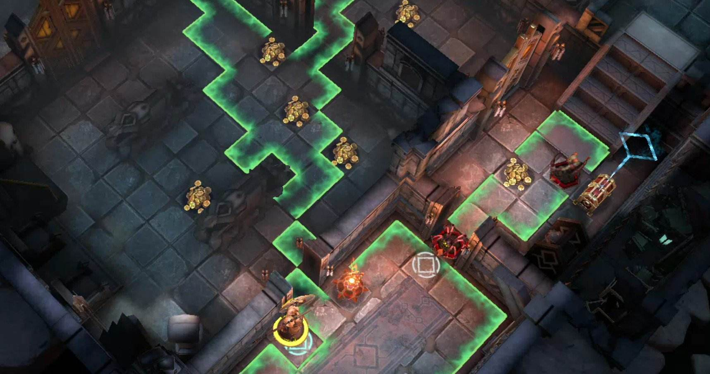

# DemeoMods

Mods for the game of Demeo, as well as the Demeo modding framework, HouseRules.

Join the Demeo modding community if you are looking for support, other Demeo mods, or are interested in learning to build your own.

[](https://discord.gg/4BNSwmr784)

## Sections

- [Latest Releases](#latest-releases)
- [Installing a Modloader](#installing-a-modloader)
  - [Installing BepInEx 5.x](#installing-a-modloader)
  - [Installing MelonLoader 0.5.7](#installing-a-modloader)
- [Mod Descriptions](#mod-descriptions)
  - [HouseRules](#mod-descriptions)
  - [RoomFinder](#mod-descriptions)
  - [AdvancedStats](#mod-descriptions)
  - [Highlighter](#mod-descriptions)
  - [RoomCode](#mod-descriptions)
  - [SkipIntro](#mod-descriptions)

## Latest Releases

> [!IMPORTANT]
> Only the PCVR and PC Edition versions of Demeo are supported.  
> E.g., playing on a Quest2 works, but only when linked to a PC.

Listed below are the latest releases for each mod.  Click to go to their respective download pages.

However, before you do, [make sure you have installed a modloader](#installing-a-modloader).

[](https://github.com/orendain/DemeoMods/releases?q=houserules)

[](https://github.com/orendain/DemeoMods/releases?q=roomfinder)

[](https://github.com/orendain/DemeoMods/releases?q=advancedstats)

[](https://github.com/orendain/DemeoMods/releases?q=highlighter)

[](https://github.com/orendain/DemeoMods/releases?q=roomcode)

[](https://github.com/orendain/DemeoMods/releases?q=skipintro)

## Installing a Modloader

In order to use any of the mods in this repository, you must have one of either two modloaders:  **BepInEx 5.x** or **MelonLoader 0.5.7**.

The difference between the two is negligible to most people, so there is no need to contemplate the selection.  Choose whichever one you have an easier time installing.

<details>
<summary><b>Installing BepInEx 5.x</b></summary><p></p>

Follow [these installation instructions](https://docs.bepinex.dev/articles/user_guide/installation/index.html#installing-bepinex-1) to install BepInEx `5.x`.
- Make sure you install one of the `5.x` versions and _not_ a `6.x` version.
- Step `3.` in the instructions above show how to check for generated files to confirm that BepInEx was successfully installed.  **Make sure to check.**
- In order for BepInEx to work, you **MUST** make some tweaks to `BepInEx/config/BepInEx.cfg`.  Replace the default `BepInEx.cfg` file with this Demeo-compatible `BepInEx.cfg` file.

When correctly installed, the final layout of your Demeo game directory should look like the following:

```
<Demeo Game Directory>/
├── BepInEx/
│   ├── cache/
│   ├── config/
│   │  └── BepInEx.cfg
│   ├── core/
│   ├── LogOutput.log
│   ├── patchers/
│   ├── plugins/
│   └── scripts/
├── demeo_Data/
├── Demeo.exe
├── doorstop_config.ini
├── MonoBleedingEdge/
├── UnityCrashHandler64.exe
├── UnityPlayer.dll
└── winhttp.dll
```
</details>

<details>
<summary><b>Installing MelonLoader 0.5.7</b></summary><p></p>

Follow [these installation instructions](https://melonwiki.xyz/#/?id=automated-installation) to install MelonLoader `0.5.7`.
- Make sure to install version `0.5.7` specifically and _not_ a `0.6.x` version.

When correctly installed, the final layout of your Demeo game directory should look like the following:

```
<Demeo Game Directory>/
├── demeo_Data/
├── Demeo.exe
├── MelonLoader/
├── Mods/
├── MonoBleedingEdge/
├── Plugins/
├── UnityCrashHandler64.exe
├── UnityPlayer.dll
├── UserData/
├── UserLibs/
└── version.dll
```
</details>

## Mod Descriptions

Expand the sections below to read more about each mod.

<details>
<summary><b>HouseRules</b></summary><p></p>

  

Set your own challenges and be the Dungeon Master of your own game. Make your own rules and challenge your friends.

HouseRules allows players to customize many settings, values and toggles used within the Demeo code.


- Change how many cards you can hold
- Adjust HP, AttackDamage, ActionPoints etc on a per-character basis
- Scale gold/mana/chests up/down
- Change starting cards dealt and max-cards allowed
- Add/Adjust AOE effects for abilities
- Remove/add casting cost for cards
- Beat-the-clock game timer modes
- Specify cards distributed to players
- Change immunities for any piece
- Prevent enemies respawing
- Keep the exit locked until all of the enemies are dead
- ... and much more.

This framework allows the definition of modular gameplay modifications (or "rules") and the ability to group them to create custom gamemodes (or "rulesets").

Rulesets can be configured as JSON files stored within the game's directory.

As long as the player hosting the game is running this mod, *ALL* Demeo players, whether modded or not, may join the room and experience the modded game.

See the [HouseRules.Core readme](HouseRules.Core/README.md) for information about the HouseRules framework.

See the [HouseRules.Essentials readme](HouseRules.Essentials/README.md) for a list of all predefined rules and rulesets.

Many in the Demeo modding community have created their own custom rulesets using HouseRules.  Join the Demeo Modding discord to explore these and share your own.
</details>

<details>
<summary><b>RoomFinder</b></summary><p></p>

Tired of Demeo's "Quickjoin" endlessly placing you into random games? This mod lists all public rooms, along with their properties, so you can pick which one to join.


</details>

<details>
<summary><b>AdvancedStats</b></summary><p></p>

Displays extra information about heroes when hovering over their pieces.


</details>

<details>
<summary><b>Highlighter</b></summary><p></p>

Provides in-game highlighting/coloring. This includes highlighting all squares that would be in a character's line-of-sight when hovering the piece over a square.



</details>

<details>
<summary><b>RoomCode</b></summary><p></p>

Set your own room code, skipping Demeo's random room code generation.  

See the [RoomCode readme](RoomCode/README.md) for more information and configuration options.
</details>

<details>
<summary><b>SkipIntro</b></summary><p></p>

The Elven Necropolis is a very welcoming place... some might say it's too welcoming.

This mod skips the intro loading scene and takes you straight into the main menu.

You will never again need to 
</details>
